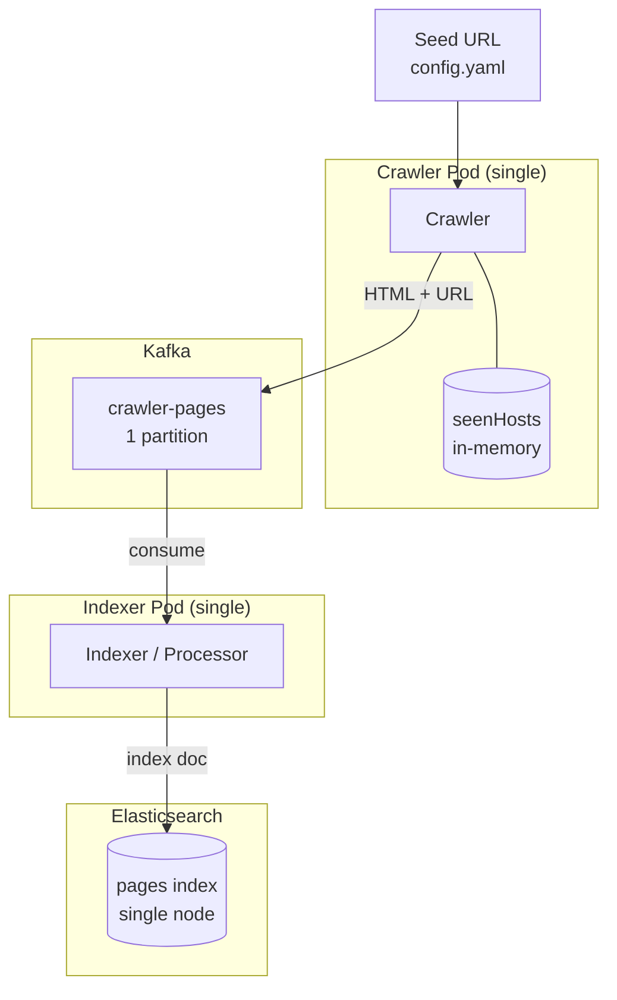
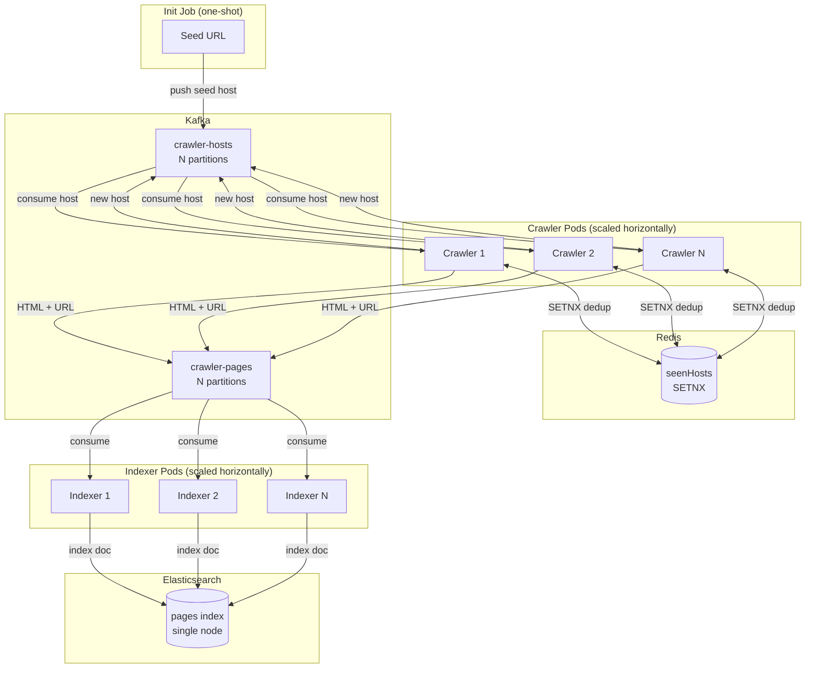

# GoSearch Architecture

## Current Architecture

```mermaid
graph TD
    subgraph Crawler Pod ["Crawler Pod (single)"]
        C[Crawler]
        SH[(seenHosts\nin-memory)]
        C --- SH
    end

    subgraph Kafka
        KP[crawler-pages\n1 partition]
    end

    subgraph Indexer Pod ["Indexer Pod (single)"]
        I[Indexer / Processor]
    end

    subgraph Elasticsearch
        ES[(pages index\nsingle node)]
    end

    SEED[Seed URL\nconfig.yaml] --> C
    C -->|HTML + URL| KP
    KP -->|consume| I
    I -->|index doc| ES
```

## Proposed Architecture

```mermaid
graph TD
    subgraph Init ["Init Job (one-shot)"]
        SEED[Seed URL]
    end

    subgraph Redis
        R[(seenHosts\nSETNX)]
    end

    subgraph Kafka
        KH[crawler-hosts\nN partitions]
        KP[crawler-pages\nN partitions]
    end

    subgraph Crawlers ["Crawler Pods (scaled horizontally)"]
        C1[Crawler 1]
        C2[Crawler 2]
        CN[Crawler N]
    end

    subgraph Indexers ["Indexer Pods (scaled horizontally)"]
        I1[Indexer 1]
        I2[Indexer 2]
        IN[Indexer N]
    end

    subgraph Elasticsearch
        ES[(pages index\nsingle node)]
    end

    SEED -->|push seed host| KH

    KH -->|consume host| C1
    KH -->|consume host| C2
    KH -->|consume host| CN

    C1 <-->|SETNX dedup| R
    C2 <-->|SETNX dedup| R
    CN <-->|SETNX dedup| R

    C1 -->|new host| KH
    C2 -->|new host| KH
    CN -->|new host| KH

    C1 -->|HTML + URL| KP
    C2 -->|HTML + URL| KP
    CN -->|HTML + URL| KP

    KP -->|consume| I1
    KP -->|consume| I2
    KP -->|consume| IN

    I1 -->|index doc| ES
    I2 -->|index doc| ES
    IN -->|index doc| ES
```
